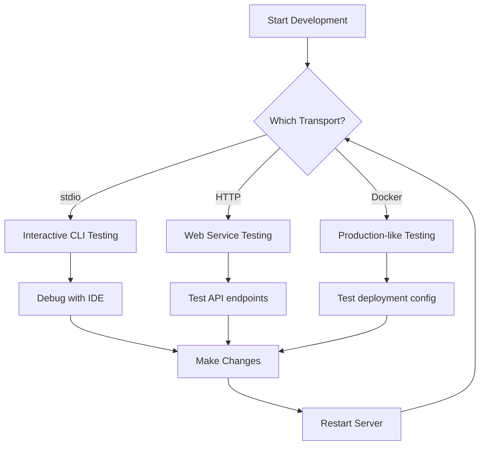

# Local Deployment Options

When developing MCP servers, you need different local deployment strategies depending on your use case. This section covers the three primary ways to run MCP servers locally: stdio transport, HTTP transport, and Docker containers.

## Local Development Scenarios

```
┌─────────────────────────────────────────────────────────────────────┐
│                         Local Deployment Options                     │
│                                                                     │
│  1. stdio transport ─────────────┐                                 │
│      (Interactive CLI)           │                                 │
│                                 ▼                                 │
│  2. HTTP transport ──────────────┼─┐                              │
│      (Web-based)                 │ │                              │
│                                 ▼ ▼                              │
│  3. Docker container ────────────┴─┐                              │
│      (Production-like)              │                              │
│                                  │ │                              │
│                                  ▼ ▼                              │
│               Common: Local development and testing                │
│                                                                     │
└─────────────────────────────────────────────────────────────────────┘
```

## 1. stdio Transport (Interactive CLI)

The stdio transport is perfect for local development and interactive testing. It runs as a child process and communicates with the MCP client through standard input/output.

### Setup

First, create a simple MCP server with stdio support:

```typescript
// server.ts
import { Server } from "@modelcontextprotocol/sdk/server/index.js";
import { StdioServerTransport } from "@modelcontextprotocol/sdk/server/stdio.js";
import {
  CallToolRequestSchema,
  ListToolsRequestSchema,
  ReadResourceRequestSchema,
  ListResourcesRequestSchema,
} from "@modelcontextprotocol/sdk/types.js";

const server = new Server(
  {
    name: "local-stdio-server",
    version: "1.0.0",
  },
  {
    capabilities: {
      tools: {},
      resources: {},
    },
  }
);

// Tool implementation
server.setRequestHandler(ListToolsRequestSchema, async () => {
  return {
    tools: [
      {
        name: "echo",
        description: "Echo back the input text",
        inputSchema: {
          type: "object",
          properties: {
            text: { type: "string" },
          },
          required: ["text"],
        },
      },
    ],
  };
});

server.setRequestHandler(CallToolRequestSchema, async (request) => {
  if (request.params.name === "echo") {
    return {
      content: [
        {
          type: "text",
          text: request.params.arguments.text,
        },
      ],
    };
  }
  throw new Error(`Unknown tool: ${request.params.name}`);
});

// Resource implementation
server.setRequestHandler(ListResourcesRequestSchema, async () => {
  return {
    resources: [
      {
        uri: "resource:///local-file",
        name: "local-file",
        description: "Access to local files",
        mimeType: "text/plain",
      },
    ],
  };
});

server.setRequestHandler(ReadResourceRequestSchema, async (request) => {
  if (request.params.uri === "resource:///local-file") {
    return {
      contents: [
        {
          uri: "resource:///local-file",
          mimeType: "text/plain",
          text: "This is a local file resource",
        },
      ],
    };
  }
  throw new Error(`Unknown resource: ${request.params.uri}`);
});

// Start server with stdio transport
const transport = new StdioServerTransport();
server.connect(transport);

console.log("Local stdio MCP server started. PID:", process.pid);
```

### Running the Server

```bash
# Install dependencies
npm install @modelcontextprotocol/sdk

# Build the server
npx tsc --outDir dist
node dist/server.js
```

### Testing with Claude Desktop

1. Open Claude Desktop settings
2. Go to "Developer > Tools > MCP servers"
3. Add the server configuration:

```json
{
  "command": "node",
  "args": ["/path/to/dist/server.js"],
  "env": {}
}
```

## 2. HTTP Transport (Web-Based)

HTTP transport is ideal for web-based applications and scenarios where you need to run your MCP server as a web service.

### Setting up HTTP Server

```typescript
// http-server.ts
import { Server } from "@modelcontextprotocol/sdk/server/index.js";
import { HTTPServerTransport } from "@modelcontextprotocol/sdk/server/http.js";
import { Server as HTTPServer } from "http";
import { json } from "body-parser";

const server = new Server(
  {
    name: "local-http-server",
    version: "1.0.0",
  },
  {
    capabilities: {
      tools: {},
      resources: {},
    },
  }
);

// Same server implementation as stdio version

// Create HTTP server
const httpServer = new HTTPServer();

// Add JSON parsing middleware
httpServer.use(json());

// Set up MCP HTTP endpoint
httpServer.on("request", (req, res) => {
  if (req.url === "/mcp") {
    const transport = new HTTPServerTransport(req, res);
    server.connect(transport);
  } else {
    res.writeHead(404);
    res.end("Not found");
  }
});

// Start HTTP server
httpServer.listen(3000, () => {
  console.log("Local HTTP MCP server started on http://localhost:3000/mcp");
});
```

### Testing HTTP Transport

```bash
# Install additional dependency
npm install body-parser http

# Build and run
npx tsc --outDir dist
node dist/http-server.js
```

Testing with curl:

```bash
# List tools
curl -X POST http://localhost:3000/mcp \
  -H "Content-Type: application/json" \
  -d '{
    "jsonrpc": "2.0",
    "id": 1,
    "method": "tools/list",
    "params": {}
  }'

# Call tool
curl -X POST http://localhost:3000/mcp \
  -H "Content-Type: application/json" \
  -d '{
    "jsonrpc": "2.0",
    "id": 2,
    "method": "tools/call",
    "params": {
      "name": "echo",
      "arguments": {
        "text": "Hello from HTTP!"
      }
    }
  }'
```

## 3. Docker Container (Production-like)

For testing production-like environments locally, Docker is the perfect solution. It provides isolation and consistency.

### Dockerfile

```dockerfile
# Dockerfile
FROM node:18-alpine

# Set working directory
WORKDIR /app

# Copy package files
COPY package*.json ./

# Install dependencies
RUN npm ci --only=production

# Copy source code
COPY . .

# Build the application
RUN npm run build

# Expose port (for HTTP transport)
EXPOSE 3000

# Command to run the server
CMD ["node", "dist/http-server.js"]
```

### docker-compose.yml

```yaml
version: '3.8'

services:
  mcp-server:
    build: .
    ports:
      - "3000:3000"
    environment:
      - NODE_ENV=production
    volumes:
      - ./logs:/app/logs
    restart: unless-stopped
    healthcheck:
      test: ["CMD", "curl", "-f", "http://localhost:3000/health"]
      interval: 30s
      timeout: 10s
      retries: 3
```

### Health Check Endpoint

```typescript
// Add to http-server.ts
httpServer.on("request", (req, res) => {
  if (req.url === "/health") {
    res.writeHead(200);
    res.json({ status: "healthy", timestamp: new Date().toISOString() });
  } else if (req.url === "/mcp") {
    // MCP endpoint logic
  } else {
    res.writeHead(404);
    res.end("Not found");
  }
});
```

### Running Docker Locally

```bash
# Build and run with Docker Compose
docker-compose up --build

# Run in detached mode
docker-compose up -d

# Check logs
docker-compose logs -f

# Clean up
docker-compose down
```

## Local Development Workflow

Here's a recommended workflow for local MCP development:



## Configuration Templates

### Development Configuration

```json
// dev-config.json
{
  "name": "development-server",
  "transport": "stdio",
  "command": "node",
  "args": ["dist/server.js"],
  "env": {
    "NODE_ENV": "development",
    "DEBUG": "mcp:*"
  },
  "cwd": "./"
}
```

### Production Configuration

```json
// prod-config.json
{
  "name": "production-http-server",
  "transport": "http",
  "url": "http://localhost:3000/mcp",
  "headers": {
    "Authorization": "Bearer your-token-here"
  }
}
```

## Common Issues and Solutions

### stdio Transport Issues

**Problem**: Server doesn't connect to Claude Desktop
```bash
# Solution: Check process permissions
# Ensure the server has proper execution permissions
chmod +x dist/server.js
```

**Problem**: Process exits immediately
```bash
# Solution: Add error handling
// server.ts
process.on('uncaughtException', (err) => {
  console.error('Uncaught Exception:', err);
});

process.on('unhandledRejection', (err) => {
  console.error('Unhandled Rejection:', err);
});
```

### HTTP Transport Issues

**Problem**: CORS errors when accessing from browser
```typescript
// Add CORS middleware
import cors from 'cors';
httpServer.use(cors());
```

**Problem**: Request timeout
```typescript
// Increase timeout
httpServer.setTimeout(30000); // 30 seconds
```


